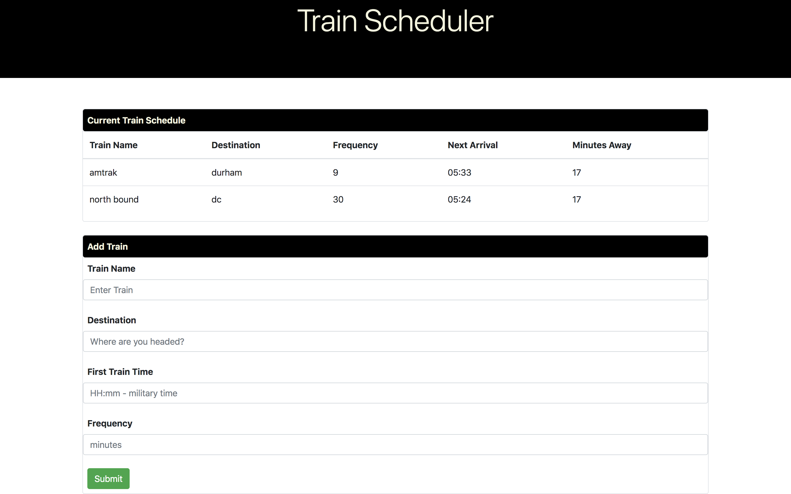
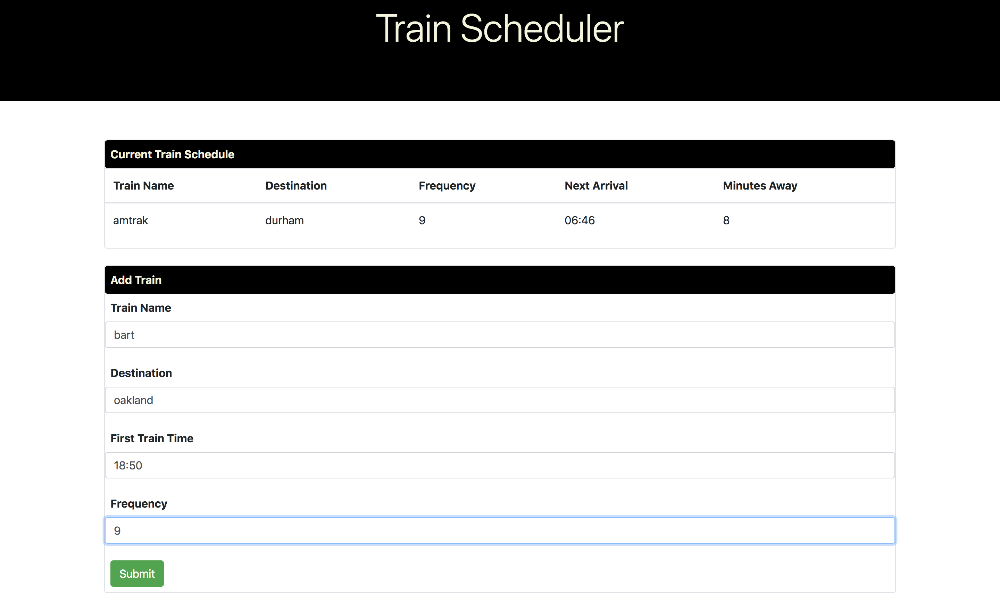
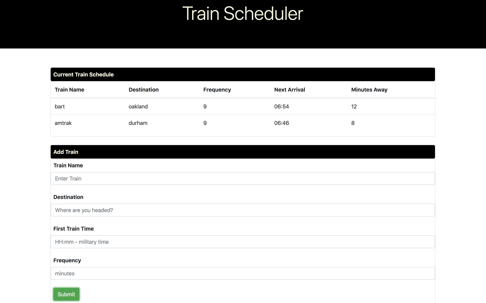

# Train Scheduler
 Train scheduler is an application that incorporates Firebase to host arrival and departure data. The app retrieves and manipulates this information with Moment.js.  This website provides up-to-date information about various trains, namely their arrival times and how many minutes remain until they arrive at their station. 

 # Getting Started 
To use this application, simply add a train and hit the submit button. 

# Demonstration
Here is a screen shot after a user has added a new train, taken just before they hit the submit button.

Once they hit the submit button, the data is sent to the database.  Moment.js is then used to retrieve and calculate the next arrival, as well as minutes away.  Then jquery dynamically adds the new trip to the Current Train Schedule.

