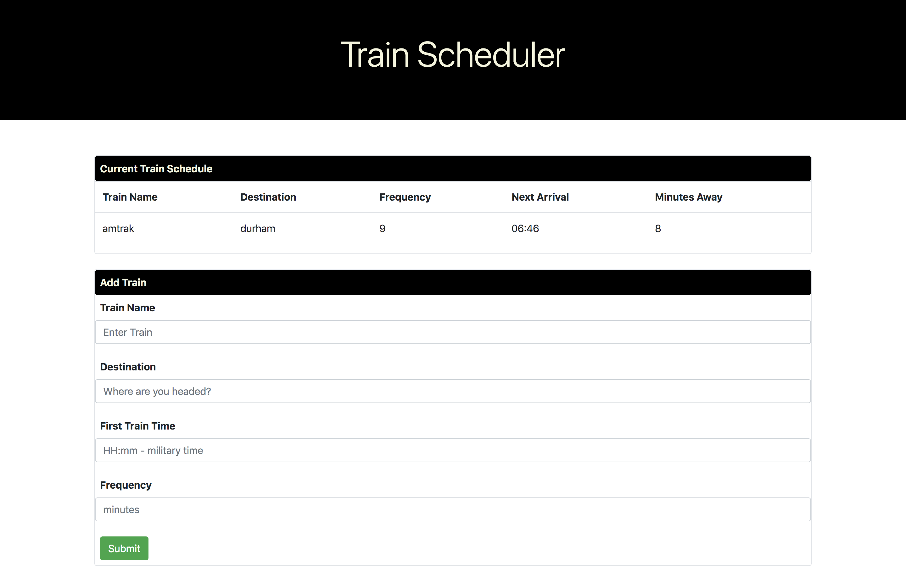

# Train Scheduler
 Train scheduler is an application that incorporates Firebase to host arrival and departure data. The app retrieves and manipulates this information with Moment.js.  This website provides up-to-date information about various trains, namely their arrival times and how many minutes remain until they arrive at their station. 

 # Getting Started 
To use this application, simply add a train and hit the submit button. 

# Demonstration
Here is a screen shot just after I've added a new train, just before I hit the submit button.

